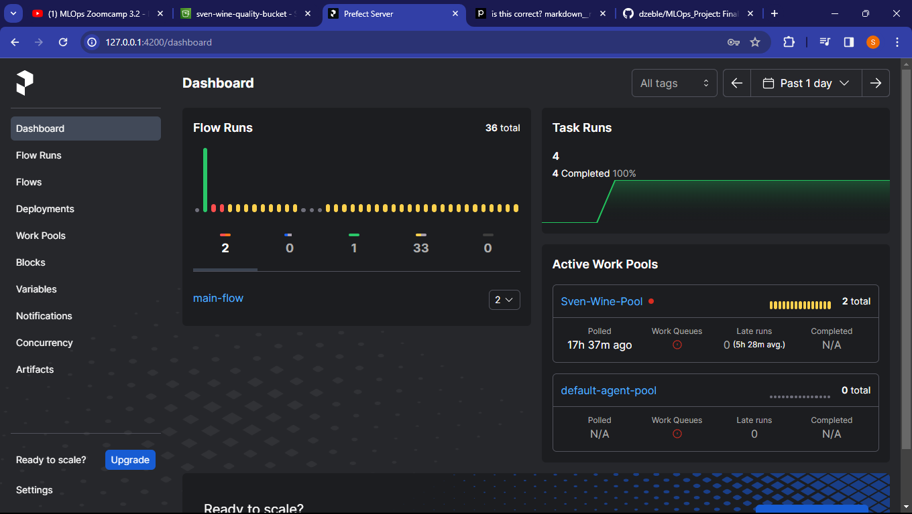
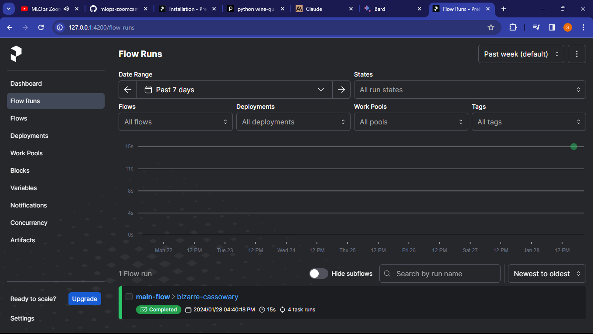

# MLOps_Project
Final Project for MLOPS learning
---
This project serves as a capstone to the tutorial sessions taken concerning the work flow of Machine Learning Operations. 

In machine learning, once the dataset is acquired, MLOps Engineers typically go through the following steps
- Model Training
- Experiment Tracking
- Orchestration 
- Deployment 
- Monitoring

So let's go through my process at tackling this problem.

### The Dataset
After spending a weekend thinking of what dataset to use, finding my Eureka moment then later seeiing the potential flaws of using the chosen dataset, I decided to work on a simple and very common dataset that I had worked on in the past. I decided to go with a Wine Quality Dataset, where some characteristics of wine are gathered and matched to what professional wine taster deem to rate the selected wine.

Instead of splitting one dataset into train and test, I decided to get two different wine quality datasets to use for each. I wanted the training dataset to be as big as possible to improve the model.

I got both my datasets from kaggle, this is the link;

- Training Set: https://www.kaggle.com/datasets/subhajournal/wine-quality-data-combined

- Validation Set: https://www.kaggle.com/datasets/rajyellow46/wine-quality 


### 1. Model Training

Before we even start the project, if you're starting from scratch then you might want to get Python installed and create a virtual environment for this.

#### - Packages
For the packages and libraies used for this particular section, we would have to ```pip install``` them. Primarily;

- ```pandas``` for data manipulation
- ```matplotlib``` and ```seaborn``` for data visualization
- ```sklearn``` for model training

#### - Inspecting the Data

Following the code in the repository,a made a ```python notebook``` file and loaded the training data and examined it. A few interesting things and be gathered from the output below which was achieved by the following code 
```python 
wine_train_df.isnull().sum()
```
The output:
```
type                    0
fixed_acidity           0
volatile_acidity        0
citric_acid             0
residual_sugar          0
chlorides               0
free_sulfur_dioxide     0
total_sulfur_dioxide    0
density                 0
pH                      0
sulphates               0
alcohol                 0
quality                 0
dtype: int64
```

Frome the out put, there are no null values (a good thing). As much as this data looks almost perfect, there was a problem.


On a closer look at the data, we can see that almost all the columns are numerical except ```type```. Numerical data is crucial when it comes to working with Machine Learning Models.

To fix this problem, I changed the values of the ```type``` column from **categorical** to **numerical** using *One Hot Encoding*


```python
from sklearn.preprocessing import OneHotEncoder

#encoding the wine types as 1 and 0 with respect to red to be computated

encoder = OneHotEncoder(sparse=False)

encode_types = encoder.fit_transform(wine_train_df['type'].values.reshape(-1, 1))
encode_types
```

the code above changes the values in the ```type``` column from white and red to 1 and 0. Now red wine will be represented as 1 and white wine as 0


#### - Training

After we have gotten the data ready, the fun part begins, *Model Training*. 

Training the model wasn't as easy as I thought. The process was pretty straight forward but my issue came from the results, they were pretty bad and not even close to accurate but as suggested by my mentor, I read a few research papers concerning the topic and they helped a lot. Not only did they suggest better models to use but they also came up with better methods.
    
I initially, removed most of the columns kept the ones that mostly affected the quality of wine (which were not many) according to the heatmap below, which was also generated by my code


I even tried to combine some of them to make new columns. But the research papers used all of them and they got better results so I went down that route. I also had to split my data into independent variables and dependent variables(target variables)


Before I talk about my model performance, let me explain the models I used

- **DecisionTreeClassifier**: This is a basic machine learning algorithm used for both classification and regression tasks. It works by splitting the data into subsets based on certain conditions, and making decisions based on those splits. Each split forms a branch of the tree, and each leaf node represents an output
- **RandomForestRegressor**: This is a type of ensemble learning method that operates by constructing multiple decision trees during training and outputting the mean prediction of the individual trees. It is particularly effective when dealing with large datasets with high dimensionality.
- **RandomForestClassifier**: Similar to RandomForestRegressor, RandomForestClassifier is also an ensemble learning method that operates by constructing multiple decision trees during training and outputting the mode of classes (classification) or mean prediction (regression) of the individual trees. It's commonly used for both classification and regression tasks
- **ExtraTreesClassifier**: This is another type of ensemble learning method similar to RandomForestClassifier. The key difference between ExtraTreesClassifier and RandomForestClassifier is how they handle categorical features. While RandomForestClassifier can handle categorical features, ExtraTreesClassifier can only handle numerical features. Because of this, ExtraTreesClassifier can sometimes achieve better performance when dealing with purely numerical datasets like this one.
- **KNeighborsRegressor**: This is a type of instance-based learning algorithm used for regression tasks. It works by finding the 'k' closest instances to the new instance and predicting the output value based on the average or median output of these 'k' closest instances. The 'k' closest instances are determined based on a distance measure, often the Euclidean distance


Now that I had my data ready, I begun the training. Through my research, I picked 5 models to use and this was the outcome on the training set.

    RandomForestRegressor
    RMSE:  {0.027071980054071056}
    Accuracy:  {0.999037171881531}
---
    RandomForestClassifier
    RMSE:  {0.0}
    Accuracy:  {1.0}
---
    ExtraTreesClassifier
    RMSE:  {0.0}
    Accuracy:  {1.0}
---
    DecisionTreeClassifier
    RMSE:  {0.0}
    Accuracy:  {1.0}
---
    KNeighborsRegressor
    RMSE:  {0.16338349530598967}
    Accuracy:  {0.9649308622642955}

**Now hold on**, let's not get too excited yet. Yes, these results look pretty impressive. Most of them are perfect but let's not forget that we haven't tested our model on the validation dataset yet.


#### - Validation

Now that we have our models trained, let's bring in the validation set. To avoid going through whole data investigation thing with the second dataset, I made it simple function to do it for me.

```python
def read_dafaframe(filename):
    df = pd.read_csv(filename)

    encoder = OneHotEncoder(sparse=False)

    encoded_types = encoder.fit_transform(df['type'].values.reshape(-1, 1))

    label= ['red','white']
    wine_types = pd.DataFrame(encoded_types, columns= label)

    df['red_wine'] = wine_types['red']

    return df
```


On working with the second dataset, I noticed something.

    #   Column                Non-Null Count  Dtype  
    ---  ------                --------------  -----  
    0   type                  6497 non-null   object 
    1   fixed_acidity         6487 non-null   float64
    2   volatile_acidity      6489 non-null   float64
    3   citric_acid           6494 non-null   float64
    4   residual_sugar        6495 non-null   float64
    5   chlorides             6495 non-null   float64
    6   free_sulfur_dioxide   6497 non-null   float64
    7   total_sulfur_dioxide  6497 non-null   float64
    8   density               6497 non-null   float64
    9   pH                    6488 non-null   float64
    10  sulphates             6493 non-null   float64
    11  alcohol               6497 non-null   float64
    12  quality               6497 non-null   int64  
    13  red_wine              6497 non-null   float64

If you take a look at the Non-Null Count column, you will see that our data has some null values in there.

There are different ways to deal with null values depending on the dataset. You can fill them with the mean value, fill them with 0 or remove those rows completely but the last method will result in other data being lost. 

Based on the dataset, I decided to fill them with the mean values 

```python
#filling in the mean values

for col, value in validation_df.items():
 if col != 'type':
    validation_df[col] = validation_df[col].fillna(validation_df[col].mean())
validation_df.isnull().sum()
```

Now that the second dataset is ready, let's test out our models on it. I dropped out decision tree to have fewer models to filter out in the next stage of the project

    RandomForestRegressor
    RMSE: 0.08215843046127176
    Accuracy: 0.9911470362380227
---
    RandomForestClassifier
    RMSE: 0.06681016826772575
    Accuracy: 0.9941457731172564
---
    ExtraTreesClassifier
    RMSE:  0.0632601533851334
    Accuracy:  0.9947513827947816
---
    KNeighborsRegressor
    RMSE: 0.260202026623686
    Accuracy: 0.9112014716834054


Well there you have it. These results aren't as perfect as the ones before but they are still super accurate. Great, our models are ready for the next stage, Experiment Tracking

### 2. Experiment Tracking

Now when it comes to getting the best results from a model, we have to look at the parameters used for the various models and see which changes can affect and improve our model. This is known as model tuning. But that sounds like a lot of work, finding the best combination of parameters to use, trying different values and going through a trial and error phase.

Luckily, there's no need to go through all of that because there is a library that does that for us and it is called ```mlflow``` and that is what we will be using in this section.

This is called **experiment tracking** and we will need to install a few more dependencies for this one. If you navigate to the **experiment tracking** folder, there is a file called **requirements.txt** and that's where our essential packages are. Once you are in this directory, go down to the terminal on your IDE and run the command ```pip install -r requirements.txt``` to install all these packages at once.


Most of the imports in the new ```notebook``` file will be the basic imports used in the **Model Training** section with a few extra.

The first import will ```mlflow``` itself.
```python
import mlflow

mlflow.set_tracking_uri("sqlite:///mlflow.db")
mlflow.set_experiment("wine-quality-experiment")
```

After running this cell in the ```.ipynb``` file, two things appear in the directory. A folder called ```mlruns``` and a file called ```mlflow.db``` . The ```mlruns``` folder is where the mlflow **runs** are stored, we'll get to that later and the ```mlflow.db``` serves as the database for our mlflow project. If you visit mlflow from a directory that does not have the ```mlflow.db``` used before, your data and your runs may not be there anymore.


So after that, we go back to what we did before. Data preparing, and model training. Luckily, the data processing function I made in the previous section came in handy here and the model training wasn't that tedious. After training a model, if the results are good, it is sometimes good to save the trained model using ```pickle``` which is what I did.


For this section, I filtered out the models I used and decided to go with ```RandomForestClassifier``` and ```ExtraTreesClassifier``` 

After training the models, ```ExtraTreesClassifier``` gave me the best results so I logged that into ```mlflow```

```python
with mlflow.start_run():

    mlflow.set_tag("developer","Sven")

    mlflow.log_param("train-data-path", "../wine_data/train_wine_data.csv")
    mlflow.log_param("valid-data-path", "../wine_data/test_wine_data.csv")

    n_estimators = 100
    mlflow.log_param('n_estimators',n_estimators)

    etc = ExtraTreesClassifier(n_estimators=n_estimators)

    etc.fit(X_train, y_train)
    y_pred_etc = etc.predict(X_val)

    rmse = mean_squared_error(y_val,y_pred_etc,squared=False)
    accuracy = r2_score(y_val,y_pred_etc)
    
    print('ExtraTreesClassifier')
    print (f'RMSE: ',{rmse})
    print(f'Accuracy: ',{accuracy})

    mlflow.log_metric("rmse", rmse)
    mlflow.log_metric("accuracy", accuracy)
    mlflow.set_tag("model", "ExtraTreesClassifier")

    mlflow.log_artifact("models/etc.bin",artifact_path="sklearn_model")
    
    mlflow.sklearn.log_model(etc,"model")
```

What this does is basically log my model parameters and metrics into ```mlflow``` after the model has been trained and tested, pretty basic, but what we wanted was to get a combination of parameters that gave us the best results. For that there a few more imports to make

```python
import xgboost as xgb
from hyperopt import  fmin, tpe, hp, STATUS_OK, Trials
from hyperopt.pyll import scope
```

The imports that will help us with the parameter tuning is called ```hyperopt``` and I added another model to use that is not part of the ```sklearn``` library like the previous ones I used


After the mlflow functions are ready and have been run, like in the code, you should see output that looks something like this:

    [0]	validation-rmse:0.77562                           
    [1]	validation-rmse:0.68940                           
    [2]	validation-rmse:0.61295                           
    [3]	validation-rmse:0.54542                           
    [4]	validation-rmse:0.48524                           
    [5]	validation-rmse:0.43219                           
    [6]	validation-rmse:0.38561                           
    [7]	validation-rmse:0.34440                           
    [8]	validation-rmse:0.30808                           
    [9]	validation-rmse:0.27634                           
    [10]validation-rmse:0.24822                          
    [11]validation-rmse:0.22376                          
    [12]validation-rmse:0.20239  
    .....


This means that our runs are being logged into ```mlflow```. To view this better, we would have to go to the ```mlflow``` UI by navigating to the directory where your ```.ipynb``` file is along with the ```mlruns``` folder and ```mlflow.db``` and run this command in your terminal;

    mlflow ui --backend-store-uri sqlite:///mlflow.db

From personal experience, it is best to do all your work in a virtual environment.

After running the command in the terminal, you should see something like this if you're running the command for the first time;


I have made an experiment already and logged some runs so this is how mine looks like:


Great, the logs appeared on mlflow. It is best to compare the runs with the tags selected and see which ones fit the requirements. We can also take a single run and see what it entails by jusy clicking on one of the run names which should take you to a page that looks something like this: 


Now we get to see all the information relating to the run. We see the parameters, tags and metrics. It is good to log this kind of imformation to mlflow. 


After selecting the best parameters, we can go a step furthur by using the ```autolog``` method.

```python
mlflow.xgboost.autolog()
```

Here, we do not have to log as many things as we did before, mlflow will do that for us. Before using the ```autolog``` method, this is how our parameters would have looked like;


Now after the ```autolog``` method, take a look at th parameters now;


Now we have 12, instead of 7 parameters. We also get some information about our model logged.


It comes along with instructions on how to use the model for prediction.

We can also ```log artifacts``` which is some information about the specfic model saved. For ExtraTreesClassifier, my code was something like this because I saved my model as ```etc.bin```;

```python
mlflow.log_artifact(local_path="models/etc.bin", artifact_path="models_pickle")
```

And for ```xgboost``` , this is how my code was;

```python
mlflow.log_artifact(local_path="models/xgb.bin", artifact_path="models_pickle")
```

And this was the result:


A good thing about logging models is that when you examin the various results, you can also compare based on models:


#### Model Registry

The last bit about the experiment tracking is called **model registry**, where you can register your models, which is essentially storing it somewhere as a chosen model given a version number. This way, you can always update your selected models according to time and you can choose which version is best. You can register a model by hitting the blue button on the far left (when you open a run) that says **Register Model**.


This will take you to your registered models. If you are following along, you might not have any models registered until you actually register them.


Model Registering can also be done in code as well as in the mlflow ui. It really depends on preference or maybe on what the task demands.

You can also assing **stages** to the versions. I found the best results to come from *Version 1* and that is why I have put it in **Production**


### 3. Orchestration

Okay, a lot of progress so far but going further, there might be a lot of things to do to the model. We might want our model to run on at a scheduled time or perhaps observe what is going on when it runs and any possible failures.

This can be possible with another library called **prefect**. Prefect alows for orchestration and observation of our workflows. Prefect is a flexible, open source Python framework to turn standard pipelines into fault-tolerant dataflows.

#### Installation

In this directory, there is also a ```requirements.txt``` in there but in addition to that, I sugest running ```pip install -U prefect``` in the terminal to get the updated version of prefect.

Prefect has lots of neat features. It runs with an Orchestartion API used by the server to work with metadata, comes with a sqlite database that is configured upon installation and a visually appealing UI.

Before I start with this section, let me clarify a few things to make sure we are on the same page.

- **Task:** A task is basically a function serving as a prefect unit.
- **Flow:** A flow is a 'container' where the tasks can be called and sent to the prefect UI.
- **Sub-flow:** A sublflow is a flow called by another flow.

Okay, let's get down to business. To run the prefect server, head down to your IDE terminal and run this:

    prefect server start

You would have to open another terminal because as long as the prefect server is running, that particular server will be unsuable. 

Once you run this command, you will be provided a link you can follow to the UI where you should see something like this:



If you are running the prefect server for the first time, your's might look a bit more bare.

#### Logging Flows

As usual, we beggin with some imports

```python
from prefect import flow, task
```
as well as our previous imports

To log the model runs as a flow on prefect, I turned all the important parts into functions or in this case, tasks. The way to turn a function into a task or a flow is by simply adding ```@task``` or ```@flow``` decorator

For instance, the function used before to read the dataframe becomes this: 

```python
@task(retries=4)
def read_dafaframe(filename):
    df = pd.read_csv(filename)

    le = LabelEncoder()
    df['type'] = le.fit_transform(df['type'])

    encoder = OneHotEncoder()
    encoded_types = encoder.fit_transform(df['type'].values.reshape(-1, 1))

    label = le.classes_.tolist()
    wine_types = pd.DataFrame(encoded_types.toarray(), columns=label)

    df = pd.concat([df, wine_types], axis=1)

    for col, value in df.items():
        if col != 'type':
            df[col] = df[col].fillna(df[col].mean())

    return df
```

The decorators can also take in arguments. For instance the decorator in this code has an argument that says ```retries=4``` , meaning that it should try again upto 4 times in the case of failure.

After I run my python script containing my tasks and flows, this what appeared on the UI:



The flow run shows logs in the terminal as it runs:


The flow run also comes with some information


#### Deployment

With prefect, it is also possible to deploy your work flows when they are ready.


    prefect deploy 'path to your python file':main_flow -n 'give it a name' -p 'name of work pool'


the ```'path to your python file'``` is basically the python files, where your tasks and flows are. You would also have to give this deployment a name and assign it to a pool so you'll have to make a pool. 


Once you do that, you can deploy. I decided to schedule my deployments within intervals.


#### AWS

It is also possible to include AWS blocks as an alternative storage unit in prefect either from the UI or from the code if you already have an existing S3 bucket on the AWS Console


We can also keep our data in the aws bucket 


